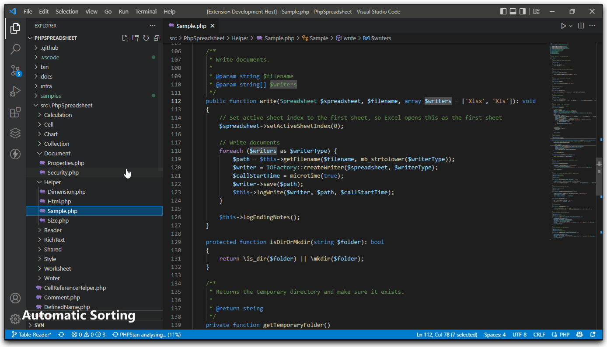
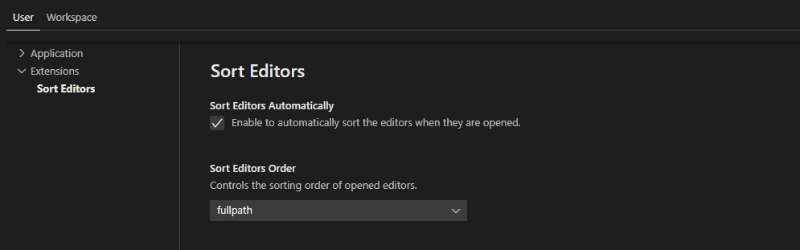

# Sort Editors for Visual Studio Code

[](https://marketplace.visualstudio.com/items?itemName=aswinkumar863.sort-editors)
[](https://marketplace.visualstudio.com/items?itemName=aswinkumar863.sort-editors)
[](https://marketplace.visualstudio.com/items?itemName=aswinkumar863.sort-editors#review-details)
[](https://marketplace.visualstudio.com/items?itemName=aswinkumar863.sort-editors)


This extension will automatically sort the editors/tabs when they are opened.

## Features

* Sorts automatically when the new editor is opened.
* Supports `alphabetical` and `fullpath` modes of sorting.
* Supports reordering of existing editors.
* Supports sorting in multiple tab groups.
* Safely ignores pinned editors.

## How it looks like




## Extension Settings




* **`sortEditors.sortEditorsAutomatically`**: Enable to automatically sort the editors when they are opened.
* **`sortEditors.sortEditorsOrder`**: Controls the sorting order of opened editors.

**For example:**

```jsonc
"sortEditors.sortEditorsAutomatically": true,
"sortEditors.sortEditorsOrder": "fullpath"
```

## Limitations
Due to limitations in the VScode Extensions API, reordering tabs/editors takes place one by one. That might feels a bit slow.

## Issues

Submit the [issues](https://github.com/aswinkumar863/sort-editors-vscode/issues) if you find any bug or have any suggestion.

## Release Notes

Detailed release notes are available [here](CHANGELOG.md).
